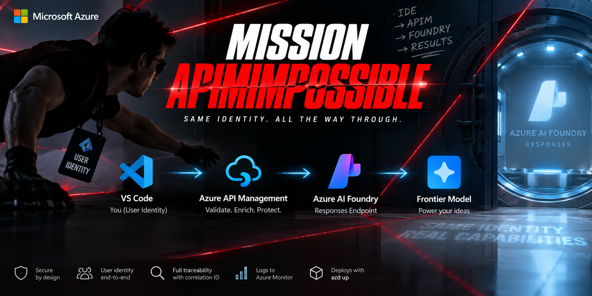

# Mission APIMpossible



**Your identity reaches the model. The gateway governs the request without becoming the caller.**

A production-quality reference for secure, identity-aware AI-assisted coding:
a developer invokes a Foundry-hosted coding model from VS Code using their own
Microsoft Entra identity, through Azure API Management, with end-to-end
correlation and no API keys anywhere.

```text
VS Code                      Microsoft Entra user token
   │                         x-correlation-id + traceparent
   ▼
Azure API Management         validate the human, govern the request,
   │                         attach the backend credential per identity_mode
   ▼
Azure OpenAI v1              POST /openai/v1/responses
   │                         brokered (default): the gateway's managed identity
   │                         calls, carrying the validated human oid as
   │                         user_security_context — so no human holds
   │                         inference RBAC and the direct bypass is
   │                         eliminated by capability
   ▼
Coding model
```

Set `identity_mode = "passthrough"` instead and the developer's original token
is forwarded unchanged, so Foundry independently authorizes that same human.
Both modes are implemented and documented; the trade between them is real and
explained in [identity modes](docs/identity-modes.md).

No Foundry Agent Service. No application backend. No API keys, no client
secrets, no on-behalf-of exchange, and no managed identity standing in for the
developer.

> **One qualified exception.** Using the gateway from an IDE that only
> understands API keys requires a small **local** process that presents a
> key-shaped surface and forwards your real Entra token. It runs as you, on
> your machine, and substitutes no identity — a courier, not a shim. Recorded
> deliberately, with its costs, in [local proxy](docs/local-proxy.md) and
> threat model T18.

---

## Why this exists

The usual "AI gateway" sample terminates the user's identity at the gateway
and calls the model with a service identity. That is simpler, and it throws
away the thing an enterprise security reviewer most wants: **which human asked
the model this?**

Here, Microsoft Entra authenticates Alice, APIM validates Alice and applies
policy to Alice, Foundry receives *Alice's* token, and Foundry's own RBAC
authorizes Alice. Four independent checks on one identity.

| Property | How |
| --- | --- |
| Identity-aware inference | Gateway validates the human; the model sees who asked |
| No secrets | Entra only; local key auth disabled on the model resource |
| No prompt or source-code logging | Zero body bytes on all four diagnostic legs |
| No server-side response storage | `store:false` enforced by policy, not by trust |
| Per-user governance | Token limits keyed on validated `tid:oid`, not a subscription key |
| Correlation without payloads | One GUID + W3C trace, prompt never leaves the request |

---

## Two identity modes

The sample supports two ways of authenticating to the model. They optimise for
different threat models, and **neither is universally correct**.

```hcl
identity_mode = "brokered"      # default
identity_mode = "passthrough"
```

**`brokered` (default)** — the gateway's managed identity holds inference RBAC
and humans hold **none**. The direct-backend bypass is eliminated *by
capability*: a developer cannot reach the model from any network position,
because they have no permission. The validated human `oid` travels as
`user_security_context`, which Microsoft documents for exactly this "AI
gateway" case.

**`passthrough`** — the developer's token is forwarded byte-for-byte and
Foundry independently authorizes the same human. True end-to-end identity, four
checks on one principal — but the human holds RBAC, so preventing the bypass
falls to network controls.

| | `passthrough` | `brokered` |
| --- | --- | --- |
| Bypass risk | Network-controlled, or accepted | **Eliminated by capability**\* |
| Foundry authenticates | The human | The gateway |
| Independent checks on identity | 2 | 1 |
| Conditional Access at model boundary | Applies | Does not |
| Blast radius of a policy mistake | Contained by Foundry RBAC | Total |

\* **Important precondition, and it bites.** Removing the account-scope role is
not enough — a role inherited from subscription or management-group scope can
still grant `Microsoft.CognitiveServices/*` as a dataAction. We hit exactly
this: a pre-existing `Foundry User` assignment kept the bypass open while the
account showed only the gateway identity.

After re-scoping that assignment, verified live with the same identity and the
same token:

```text
direct to Foundry    HTTP 401  BLOCKED - no RBAC
through the gateway  HTTP 200  WORKS
```

Run `.\scripts\verify-brokered-identity.ps1 -PrincipalId <oid>` before trusting
brokered mode; `.\scripts\rescope-foundry-user.ps1` fixes the common cause.

Full comparison, including the confused-deputy risk brokered mode accepts:
[`docs/identity-modes.md`](docs/identity-modes.md).

---

## Two patterns, deployed independently

| | `public` | `private` |
| --- | --- | --- |
| APIM ingress | Public HTTPS | Private endpoint, public access disabled |
| Foundry ingress | Public, Entra + RBAC | Private endpoint, public access disabled |
| Direct Foundry bypass | Blocked by `brokered` identity | Blocked by identity **and** network |
| Inference traffic path | Public internet (TLS) | Stays inside the VNet |
| Test access | Your workstation | Optional Windows jumpbox + Bastion |
| Best for | Evaluating the pattern | Enterprise adoption |

They share Terraform modules, policy, and clients, but have separate azd
environments, state, and resources. Deploying or destroying one never touches
the other.

### The bypass problem, stated plainly

If a developer holds `Cognitive Services OpenAI User` and the Foundry endpoint
is reachable, they can call the model directly and skip every gateway control.

There are two ways to stop that, and this repository now implements both:

- **Identity** (`identity_mode = "brokered"`, the default) — the human holds no
  RBAC at all. Strictly stronger, because no network position confers a
  permission that does not exist.
- **Network** (`deployment_profile = "private"`) — NSG rules on the Foundry
  private endpoint. Note that *a private endpoint alone is not enough*: private
  endpoints are reachable over peering, VPN, and ExpressRoute under the default
  `AllowVNetInBound` rule, so the control is explicit deny rules.

With brokered mode as the default, the private profile's NSG rules become
**defence in depth** rather than the primary control, and its real purpose
becomes keeping inference traffic off the public internet. See
[`docs/architecture.md`](docs/architecture.md).

---

## Quick start

### Prerequisites

Azure subscription • Entra tenant • Terraform ≥ 1.16 • Azure CLI ≥ 2.86 •
azd ≥ 1.33 • Python ≥ 3.12 with uv • Node ≥ 20 (for the extension)

You also need a **verified model choice**. This repository intentionally ships
no default region or model — see [Choosing a model](#choosing-a-model).

### Deploy

```powershell
git clone <repo> && cd mission-apimpossible

# Choose a pattern
Copy-Item infra\profiles\public.tfvars.example infra\profiles\public.tfvars
# ...fill in subscription, tenant, region, model, audience, principals

az login --tenant <tenant-id>
azd auth login
azd env new map-public
azd up
```

`azd up` provisions APIM, the Foundry account and model deployment, RBAC, Log
Analytics, Application Insights, the API, policies, and diagnostics. No portal
configuration is required.

### Use it

```powershell
$env:MAP_ENDPOINT   = "<from azd output>"
$env:MAP_MODEL      = "<from azd output>"
$env:MAP_TENANT_ID  = "<your tenant>"

uv run python examples/python/respond.py "Review this function for races."
```

```text
Model              : coding-model
Correlation ID     : 78e5a796-0f30-472d-8491-ce2d857850ad
Trace ID           : 5b8aa5a2d2c872e8321cf37308d69df2
Foundry Request ID : 97f2c1e4-...
Status             : completed
Tokens in/out/total: 412/1180/1592
Usage source       : reported
```

There is no API key to configure. There is no key.

### Use it from an IDE

Most IDEs offer a "bring your own key" box — a base URL and a static secret.
None of them can perform an interactive Entra sign-in or refresh an hourly
token, so the gateway is unusable from them as-is.

A small **local Entra proxy** closes that gap. It presents a key-shaped surface
on loopback and forwards your real Entra token to the gateway:

```
IDE  ──127.0.0.1, local secret──▶  proxy  ──Bearer <your Entra token>──▶  APIM  ──▶  Foundry
```

The IDE thinks it is talking to an ordinary key-authenticated provider. The
request that leaves your machine carries your own identity, and telemetry still
attributes it to you. The demonstration is the point: **Copilot running in
bring-your-own-key mode, where the key is not a key — it is Entra.**

The proxy forwards the body **unchanged**. It translates nothing and rewrites
nothing, so the gateway remains the single place the request contract is
enforced and proven.

> **Status: designed, not yet implemented.** See
> [Local Entra proxy](docs/local-proxy.md) for the contract, the security
> model, and why a local identity *courier* is not the server-side
> authentication *shim* this design forbids — recorded as an explicit exception
> with its own threat-model entry (T18).

### Tear down

```powershell
azd down --purge
```

---

## Choosing a model

`infra/variables.tf` supplies **no default** for `location`, `model_name`,
`model_version`, `model_sku`, or `model_capacity`. Deployment fails closed
until you choose.

That is deliberate. Model GA status, regional availability, eligibility for
*new* deployments, available quota, and data-processing residency are five
separate checks, and a convenient default here would invite deploying
something stale, unavailable, or in the wrong jurisdiction.

Verify against
[model availability](https://learn.microsoft.com/azure/foundry/foundry-models/concepts/models-sold-directly-by-azure-region-availability),
[lifecycle](https://learn.microsoft.com/azure/foundry/openai/concepts/model-retirements),
and [quota](https://learn.microsoft.com/azure/foundry/openai/how-to/quota).

---

## Repository layout

```text
infra/          Terraform - the only IaC. Two profiles, shared modules.
policies/       APIM policy-as-code. Fragments composed in security order.
specs/          Request allowlist and telemetry schemas (JSON Schema).
examples/       Python CLI and curl samples.
src/vscode/     Minimal VS Code extension using built-in Microsoft auth.
queries/        KQL for correlation, usage, failures, throttling, latency.
scripts/        Preflight, policy validation, jumpbox bootstrap.
tests/          Offline unit/contract tests, opt-in live integration tests.
docs/           Architecture, security, threat model, cyber review.
```

---

## Documentation

| Document | Read it for |
| --- | --- |
| [Architecture](docs/architecture.md) | Both patterns, runtime flow, identity boundaries |
| [Local Entra proxy](docs/local-proxy.md) | Using the gateway from key-expecting IDEs |
| [API contract](docs/api-contract.md) | What is allowed, what is rejected, status codes |
| [Security](docs/security.md) | Controls, and the limits of each one |
| [Threat model](docs/threat-model.md) | Threat → control → residual risk |
| [Cyber review](docs/cyber-review.md) | One-stop pack for a security reviewer |
| [Platform validation](docs/platform-validation.md) | Evidence, and what is still unproven |
| [Observability](docs/observability.md) | Correlation chain and its real boundary |
| [Private test access](docs/private-test-access.md) | Jumpbox, Bastion, and gate G4 |
| [Enterprise adoption](docs/enterprise-adoption.md) | VPN/ExpressRoute, DNS, shared state |
| [Implementation plan](docs/implementation-plan.md) | The plan this was built from |

---

## Status and honest limitations

**Goal 1 is complete and proven against a live deployment.** A developer calls
a Foundry model through APIM as themselves, with attribution, correlation, and
no keys anywhere. Fourteen security controls pass; brokered identity is
verified end to end (direct call `401`, through the gateway `200`).

**Goal 2 — using that endpoint from key-expecting IDEs — is designed, not yet
built.** See [`docs/local-proxy.md`](docs/local-proxy.md).

Gate evidence lives in
[`docs/platform-validation.md`](docs/platform-validation.md); execution status
is in beads (`bd ready`).

| Gate | State |
| --- | --- |
| G1 token audience and claims | Proven — audience measured, not assumed |
| G2 delegated-human authorization | Proven |
| G5 token governance | Proven, and more interesting than expected — see below |
| G7 request-validation ceilings | Proven — 14 hostile shapes fail closed; found and fixed two defects |
| G8 private networking | Deployed to a second resource group, verified, destroyed |
| G9 Terraform state contract | Audited — 23 resources, zero violations |
| G3 IDE authentication | Partially proven; interactive flow needs a human |
| G4 Windows jumpbox | **Unresolved by design** |

Known unresolved items, stated rather than buried:

- **Gate G4 — Windows jumpbox access.** Portal Entra RDP is in *public
  preview*, native-client Entra RDP *prompts for a password*, and the AzureRM
  Windows VM *stores its password in state*. All three conflict with an agreed
  requirement. The module fails closed behind
  `acknowledge_unresolved_g4`.
- **The private pattern is proven closed, not proven usable.** Public access is
  disabled, the NSG rules deny the jumpbox subnet directly to the model, and an
  authorized human is blocked from the internet. What has *not* been shown is a
  developer inside the VNet succeeding through the gateway — that needs the
  jumpbox, which G4 blocks.
- **Only `rate-limit-by-key` constrains a burst.** With
  `estimate-prompt-tokens="false"`, `llm-token-limit` cannot pre-charge, so it
  never rejects a concurrent request — measured: ten simultaneous requests each
  saw only their own consumption, and ~16,000 tokens crossed a 20,000 ceiling.
  It is an after-the-fact ceiling, not a burst bound. `calls="2"` also admitted
  **five** concurrent requests, because counters are per gateway node.
- **Token accounting is approximate.** Quotas are operational safeguards, not
  billing controls. Azure Cost Management remains the financial source of truth.
- **The correlation chain ends at the gateway.** Foundry's `apim-request-id`
  is a support handle for raising a case — not a joinable trace segment. No
  first-party source establishes that `x-ms-client-request-id` is queryable
  downstream.
- **`store:false` governs Responses storage**, not every service-side abuse
  monitoring mechanism.
- **`Cognitive Services OpenAI User` is broader than Responses.** It is the
  least-privileged *built-in* role that works; a narrower custom role is a
  documented hardening option, not a default.
- **Foundry reports a network denial as an authorization-shaped 401.** When a
  private-pattern call fails, check `publicNetworkAccess` and the effective NSG
  rules *before* touching role assignments.

---

## Contributing

Run before opening a PR:

```powershell
.\scripts\validate-policies.ps1     # policy XML + security invariants
terraform -chdir=infra fmt -check -recursive
terraform -chdir=infra validate
uv run pytest
```

Adding a field to the request allowlist requires a documented threat model.
That friction is the feature.

## License

[MIT](LICENSE).
